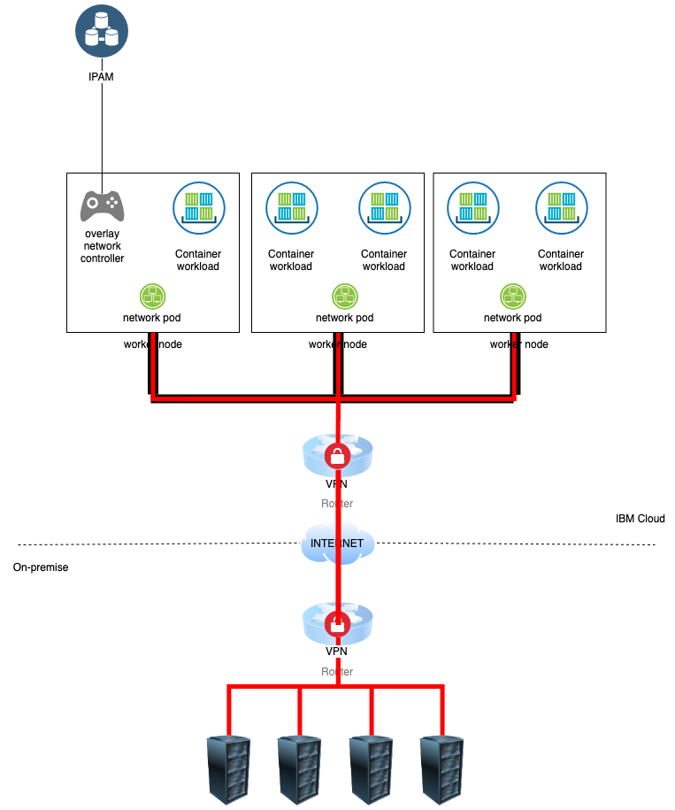

# iks-overlay-ip-controller

A controller/daemonset that can create and manage an overlay network and static routes for worker nodes from IBM Kubernetes Service.  The Overlay network IP addresses are drawn from a phpIPAM instance that can be run from inside or outside of IKS.

We are able to create an overlay network with IPs drawn from a subnet that allows communication to on-premise networks without NAT.

## Architecture 

This project uses the [operator-sdk](https://github.com/operator-framework/operator-sdk) to build a controller around CustomResourceDefinitions.



The controller consists of two components:
- The `overlay-network-controller` reserves IP addresses in an IPAM system for each node in the cluster ([phpIPAM](https://phpipam.net/) in this case)
- The `overlay-network-pod` daemonset runs on every worker node in the cluster, and configures the worker node with the IP address reserved from IPAM.

## Prerequisites

The project requires:
- An [IKS cluster](https://www.ibm.com/cloud/container-service) 
- An instance of [phpIPAM](https://phpipam.net/) must be reachable from the controller.  This may be run inside the Kubernetes cluster as a deployment.
  - IP Pools to draw from for each worker node must be set up in phpIPAM
- Each VLAN the worker nodes are in must have a Virtual Router Appliance at the edge of the VLAN that routes the overlay network.  For example, if the worker nodes are assigned a subnet `192.168.100.0/24`, the Virtual Router Appliance must be configured as the gateway for this subnet (typically this means configuring the appliance with the address `192.168.100.1` on the VLAN).

## Function Description

### Overlay IP management

The `overlay-network-controller` deployment watches `Node` resources in Kubernetes and creates a `NodeOverlayIp` resource for each node.  IP address is reserved for each `NodeOverlayIp` address and set in the `Status` block.  If `NodeOverlayIp` resources are deleted (for example when a `Node` resource is removed from the cluster), the corresponding IP address is released from IPAM system.

The `overlay-network-pod` daemonset will watch `NodeOverlayIp` objects and configure its worker node with the IP address set in the `Status` block.

Here is an example `NodeOverlayIp` resource for the worker node `10.176.162.151`:

```yaml
apiVersion: iks.ibm.com/v1alpha1
kind: NodeOverlayIp
metadata:
  creationTimestamp: 2019-06-17T17:52:11Z
  finalizers:
  - finalizer.iks.ibm.com
  generation: 1
  labels:
    node: 10.176.162.151
    region: us-south
    zone: dal10
  name: 10.176.162.151
  resourceVersion: "756505"
  selfLink: /apis/iks.ibm.com/v1alpha1/nodeoverlayips/10.176.162.151
  uid: a23e85ba-9128-11e9-85d4-8e97af49c5de
spec: {}
status:
  gateway: 192.168.100.1
  ipAddr: 192.168.100.4/24
```

### Static Route Management

A `CustomResourceDefinition` for `StaticRoute` can be used to add on-premise networks that may be reached from the overlay network.  For example, to allow worker nodes to reach `192.168.0.0/24`, create the `StaticRoute` object:

```yaml
apiVersion: iks.ibm.com/v1alpha1
kind: StaticRoute
metadata:
  name: onprem-192.168.0.0-24
spec:
  subnet: 192.168.0.0/24
```

The `overlay-network-pod` daemonsets will add the subnet specified in `spec.subnet` to each worker node's route table using the overlay network's gateway.  The `Status` section is updated with each node's information after the route has been added.  Here is an example after three nodes in the cluster have added the route:

```yaml
apiVersion: iks.ibm.com/v1alpha1
kind: StaticRoute
metadata:
  name: onprem-192.168.0.0-24
  creationTimestamp: 2019-06-17T17:53:34Z
  finalizers:
  - finalizer.iks.ibm.com
  generation: 1
  resourceVersion: "756678"
  selfLink: /apis/iks.ibm.com/v1alpha1/staticroutes/onprem-192.168.0.0-24
  uid: d33ad788-9128-11e9-85d4-8e97af49c5de
spec:
  subnet: 192.168.0.0/24
status:
  nodeStatus:
  - device: tmp0
    gateway: 192.168.100.1
    hostname: 10.176.162.151
  - device: tmp0
    gateway: 192.168.100.1
    hostname: 10.176.162.168
  - device: tmp0
    gateway: 192.168.100.1
    hostname: 10.176.162.156
```

## Installation

1. Install MySQL and phpIPAM.  Installation is out of scope of this document, although there are some docker images and github repos that may help [here](https://github.com/pierrecdn/phpipam) and [here](https://github.com/mrlesmithjr/docker-phpipam).

2. Log in to phpIPAM using the default administrator and create a user used for automation.

3. Enable the API, and create an App ID for the automation.

4. Create one or more subnets to be used for each zone the IKS cluster is deployed to, the worker nodes' overlay IP addresses will be drawn from these subnets.

5. Mark the gateway address in each of the subnets so it won't be reserved by any worker nodes.  Reserve any additional IP addresses you do not with to be used by worker nodes.

6. Configure the gateway appliance at the edge of each of the zones to route the subnet by configuring it with the gateway address.

7. Provision the IKS cluster on the correct VLANs.  Note that public interfaces are not required for worker nodes, but in order to reach Docker hub where the pre-built container images are stored, outbound connectivity must be enabled on the gateway appliances .  Alternatively the containers may be built and pushed to the IBM Container Registry instead, which is reachable from the private network.

8. Create a secret for phpIPAM by first [authenticating to the Kubernetes Cluster](https://cloud.ibm.com/docs/containers?topic=containers-cs_cli_install#cs_cli_configure), then executing the following:

   ```bash
   kubectl create secret generic phpipam-secret --from-literal username=<phpipam_username> --from-literal password=<phpipam_password>
   ```

9. Modify the configmap in [deploy/controller-configmap.yaml](./deploy/controller-configmap.yaml) with the correct URL, app ID, and subnet IDs for phpIPAM.  For example, if the cluster is deployed in `dal10`, and subnet ID `7` is used, use the following configuration:

   ```yaml
   apiVersion: v1
   kind: ConfigMap
   metadata:
   name: overlay-ip-controller-config
   data:
   overlay-ip-config.yaml: |
       phpIPAM:
       url: http://phpipam
       appID: iks
       subnetMap:
           dal10:
           - 7
   ```

   Apply it to the cluster using the following:

   ```bash
   kubectl create -f deploy/controller-configmap.yaml
   ```

10. Apply the RBAC to the cluster:

    ```bash
    kubectl create -f deploy/service_account.yaml
    kubectl create -f deploy/role.yaml
    kubectl create -f deploy/role_binding.yaml
    ```

    This sets the permissions to the parts of the Kubernetes API that the controller and daemonset are allowed to read and write to.

11. Create the `CustomResourceDefinitions`:

    ```bash
    kubectl create -f deploy/crds/iks_v1alpha1_nodeoverlayip_crd.yaml
    kubectl create -f deploy/crds/iks_v1alpha1_staticroute_crd.yaml
    ```

    These provide the resource definitions that will be used by the controller.

12. Create the `overlay-network-controller` deployment and `overlay-network-pod` daemonset:

    ```bash
    kubectl create -f deploy/operator.yaml
    kubectl create -f deploy/network-pod-daemonset.yaml
    ```

    Once these are started, IPs for each of the Nodes should be reserved in phpIPAM, you may check the IPs by examining the `NodeOverlayIp` resources created, e.g.

    ```bash
    kubectl get nodeoverlayips -o yaml
    ```

13. To apply additional static routes to each node in the cluster, create the `StaticRoute` CustomResource, following the example in `deploy/crds/iks_v1alpha1_staticroute_cr.yaml`.